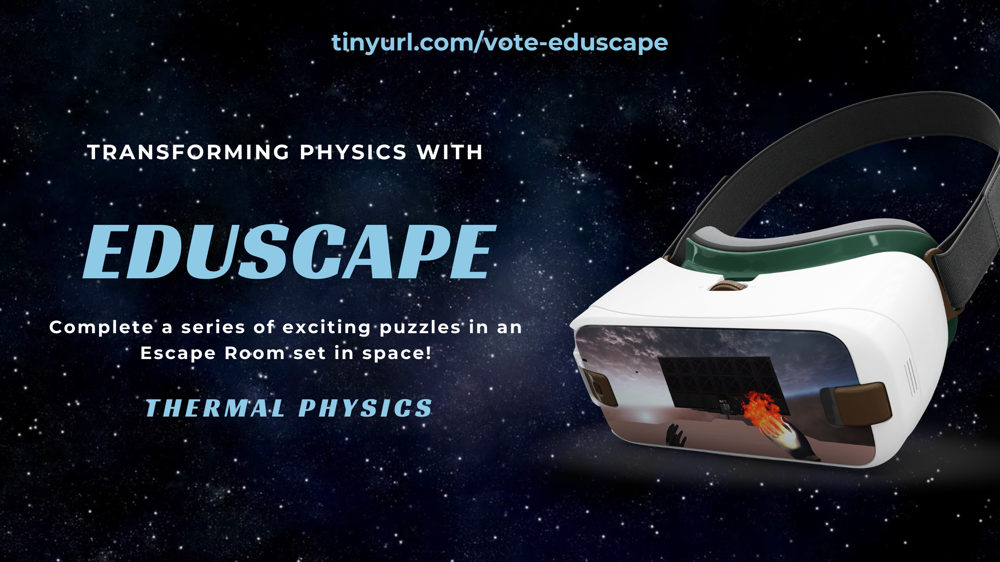

### A Note on This Repository

This repository contains **only** the C# scripts created for the Eduscape project.
The original project repository was too large to maintain on GitHub without incurring a monthly fee and so was taken down.
The C# scripts have been uploaded here for preservation purposes, and so some future reference to the project can be maintained online.

# 🚀 Eduscape

Eduscape is a single-player VR Escape Room aimed at making learning Physics fun and efficient for secondary school students.

As of v1.0, Eduscape covers *🔥 Thermal Physics*.
See a video playthrough of the game [here](https://www.youtube.com/watch?v=bl38ZaQcHwc)!

## Features
- Immersive
  - Allows players to possess and use elements (metal, water, fire) to learn about the different states of matter
- Guided
  - Tutorial at the start of game on the controls
  - Hints given for difficult puzzles
- Enjoyable
  - Teleportation instead of movement to prevent motion sickness, especially for first-time VR users
  - Ambient music and beautiful scenes
  - Exciting end-game sequence to reward players for solving the puzzles
- Educational
  - Each puzzle links to the [Singapore-Cambridge GCE O Level Physics Syllabus](https://www.seab.gov.sg/docs/default-source/national-examinations/syllabus/olevel/2021syllabus/6091_y21_sy.pdf)
  - Learning objective of each puzzle summarised for players after solving it, reminding them of important concepts

## Acknowledgements
Eduscape was created for the module CS4240 Interaction Design for Virtual and Augmented Reality at the National University of Singapore in Spring 2021, under the supervision of [Senior Lecturer Anand BHOJAN](https://www.comp.nus.edu.sg/cs/bio/bhojan/).

## Credits

### Assets
- [AllSky Free - 10 Sky / Skybox Set](https://assetstore.unity.com/packages/2d/textures-materials/sky/allsky-free-10-sky-skybox-set-146014)
- [Asteroids Pack](https://assetstore.unity.com/packages/3d/environments/asteroids-pack-84988)
- [Hi-Rez Spaceships Creator Free Sample](https://assetstore.unity.com/packages/3d/vehicles/space/hi-rez-spaceships-creator-free-sample-153363)
- [Sci Fi Doors](https://assetstore.unity.com/packages/3d/environments/sci-fi/sci-fi-doors-162876)
- [Sci-Fi Styled Modular Pack](https://assetstore.unity.com/packages/3d/environments/sci-fi/sci-fi-styled-modular-pack-82913)
- [Unity Particle Pack](https://assetstore.unity.com/packages/essentials/tutorial-projects/unity-particle-pack-127325)
- [VR Cinema for Mobile](https://assetstore.unity.com/packages/3d/props/interior/vr-cinema-for-mobile-150120)
- [Universal Sound FX](https://assetstore.unity.com/packages/audio/sound-fx/universal-sound-fx-17256)
